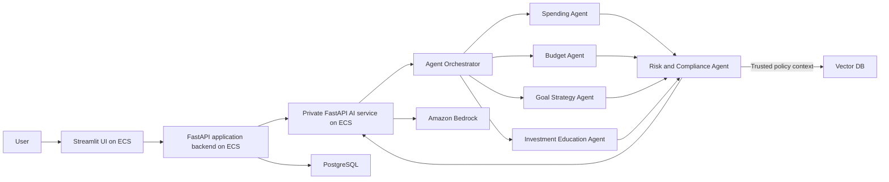
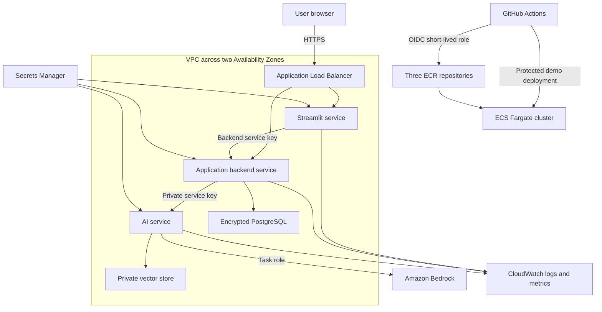

# Architecture

## Logical View

## Target Physical AWS View

The target architecture terminates TLS at the ALB and keeps ECS tasks and data stores in private subnets. Its security groups permit only ALB-to-service, backend-to-AI, backend-to-PostgreSQL, and AI-to-vector traffic.

The provisioned minimum demo intentionally differs: it uses an HTTP ALB and three single-task Fargate services in public subnets to avoid NAT Gateway cost. Each task receives a public IP for outbound AWS service access, but security groups deny direct internet ingress. PostgreSQL and a managed vector store are deferred because their adapters are not yet implemented. The AI service is not ALB-exposed; successful backend coaching verifies the private service-discovery hop end to end. Use synthetic data only until TLS and the target private network are implemented.

The synthetic demo uses a backend service key. Before real users, the public application boundary moves to OIDC/JWT identity and authorization while the independent backend-to-AI credential remains a service secret.

## Service Boundaries

- Streamlit frontend: captures financial inputs, calls the application backend server-side, and presents answers, agent rationale, confidence, disclaimers, and audit metadata.
- FastAPI application backend: owns user-facing APIs, access control, application workflows, and future user, transaction, goal, and PostgreSQL persistence features. It is the only application service allowed to call the AI service.
- FastAPI AI service: validates internal requests, orchestrates agents, applies shared guardrails, performs controlled retrieval, and integrates with Bedrock.
- Data services: PostgreSQL stores transactional and audit records; the vector store contains curated MAS, CPF, and financial literacy content.
- AWS boundary: ECS runs all three services, Secrets Manager supplies separate frontend-to-backend and backend-to-AI credentials, Bedrock supplies models, and CloudWatch captures operational telemetry.

Each FastAPI health endpoint is available for load balancer checks. Both coaching boundaries require an `X-API-Key`: Streamlit receives only `BACKEND_API_KEY`, while the backend receives `AI_SERVICE_API_KEY`. The AI service remains on private networking and is not exposed to the browser or public load balancer.

## Architecture Decision

The original proposal specified Angular, Spring Boot, and a separate Python AI service. The implementation uses Streamlit for presentation, FastAPI for the application backend, and FastAPI for the private multi-agent service. Python reduces language overhead while the explicit backend/AI boundary preserves separate ownership, scaling, security, and deployment concerns.

Streamlit scales for concurrent UI sessions, the backend scales for application traffic, and the AI service scales for model-bound workloads. The backend is ready to add identity, transactions, goals, persistence, and audit workflows without coupling those concerns to agent orchestration.

ECS Fargate remains preferable to EKS for the initial scope because there are only three independently scalable services and no Kubernetes-specific platform requirement. The minimum demo uses two-AZ subnet placement, health checks, managed rolling deployment, circuit-breaker rollback, and stateless service design with less operational overhead. Its desired count of one per service is cost-minimal, not highly available; raise the count to at least two and add autoscaling for an availability test or production. Revisit EKS if independently owned agent workloads require Kubernetes scheduling, policy, or ecosystem capabilities.

## Orchestration

The implemented LangGraph workflow is `guard_input -> route -> run_specialists -> synthesize -> review_compliance -> finalize`. The router, specialist narratives, synthesis, and compliance review are model calls with non-zero temperatures. The graph can branch to one or more specialists based on structured router output.

Hard boundary controls run before the first model call. Each specialist receives minimized deterministic grounding according to its role. Risk and Compliance alone can retrieve trusted, sanitized RAG context; Investment Education has no retrieval permission. Structured model responses are schema-validated, and the independent compliance result can block the draft before release. Local and CI integration use an explicitly configured offline fixture; ECS requires the Bedrock provider.

## MCP And A2A Position

MCP is relevant when the system needs a standard way to expose retrieval, budget calculators, policy engines, or external data connectors. The current AI service uses an internal tool registry and allowlist first. MCP can be added later at that boundary if it improves governance and integration reuse.

A2A becomes relevant if agents are independently deployed services owned by different teams or runtimes. The current implementation keeps agents in one FastAPI service for lower latency and simpler auditability.
