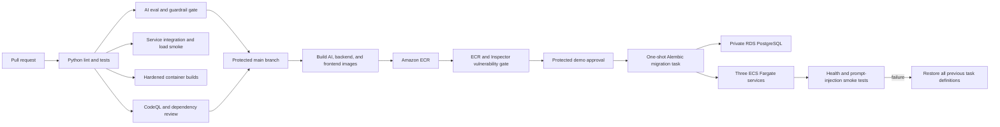

# CI/CD And LLMSecOps Pipeline

## Implemented Flow



The first deployment target remains ECS Fargate. EKS is outside the initial pipeline and remains a future option if independently owned agent workloads need Kubernetes-specific scheduling, policy, or ecosystem capabilities.

## Workflow Files

- `.github/workflows/ci.yml`: Streamlit, backend, and AI service tests; PostgreSQL migration application and drift checks; CloudFormation and Compose validation; service integration and load smoke; hardened container builds; CodeQL; dependency review; and LLMSecOps threshold/regression gates. It also runs weekly for drift observation.
- `.github/workflows/release.yml`: immutable container builds, ECR publishing and scanning, a one-shot Alembic migration, protected ECS deployment, smoke testing, and coordinated service rollback.
- `.github/dependabot.yml`: weekly GitHub Actions and Python dependency updates.
- `infra/llmsecops/evaluation-policy.json`: versioned release thresholds.

The release workflow starts only after a successful `CI and LLMSecOps` run caused by a push to `main`. Weekly drift runs and manual CI runs do not deploy.

## AWS Provisioning

The minimum demo resources are implemented as CloudFormation in `infra/aws`. Run `infra/scripts/bootstrap_demo.ps1` to provision:

- Three ECR repositories, one for each service, with enhanced Inspector scanning.
- An ECS cluster with one minimum-size task per service, health checks, and deployment circuit-breaker rollback.
- Existing ECS task definitions whose container names match the GitHub variables below.
- Secrets Manager values for `BACKEND_API_KEY` and `AI_SERVICE_API_KEY`. Streamlit receives only the backend key; the backend receives both; the AI service receives only its internal key.
- An encrypted, non-public, Single-AZ RDS PostgreSQL instance with an RDS-managed master secret and backend-only security-group ingress.
- CloudWatch logs, service alarms, and deployment-failure EventBridge notifications.
- Bedrock access restricted to the configured APAC inference profile and its destination foundation models for the AI task role.

The executable demo uses PostgreSQL for profiles, transactions, monthly budgets, goals, and backend-built snapshots. Dashboard summaries are computed by the backend from those persisted records. An external vector store remains deferred until its managed adapter exists.

AWS Cloud Map provides private DNS between services. The deployment smoke test enters through the runner-reachable backend route and proves the private AI hop without exposing the AI service.

Deploy `infra/aws/github-actions-oidc.yaml` once to create separate publishing and deployment roles. Pass the exact OIDC subject claims used by the repository:

```text
SUBJECT_PREFIX:ref:refs/heads/main
SUBJECT_PREFIX:environment:demo
```

Read `SUBJECT_PREFIX` from the repository OIDC configuration; repositories using immutable subjects include numeric owner and repository IDs. The bootstrap script discovers this value and passes both exact claims. If the AWS account already has the GitHub OIDC provider, pass its ARN through `ExistingGitHubOidcProviderArn`. Deploy with `CAPABILITY_NAMED_IAM`.

## GitHub Configuration

Create a `demo` environment, restrict it to `main`, and add required reviewers. Configure these repository or environment variables:

| Variable | Purpose |
|---|---|
| `AWS_REGION` | AWS region, default `ap-southeast-1` |
| `AWS_PUBLISH_ROLE_ARN` | OIDC role for ECR publishing and scan reads |
| `AWS_DEPLOY_ROLE_ARN` | OIDC role used by the protected environment |
| `ECR_AI_REPOSITORY` | FastAPI ECR repository name |
| `ECR_BACKEND_REPOSITORY` | Application backend ECR repository name |
| `ECR_FRONTEND_REPOSITORY` | Streamlit ECR repository name |
| `ECS_CLUSTER` | ECS cluster name |
| `ECS_AI_SERVICE` | FastAPI ECS service name |
| `ECS_BACKEND_SERVICE` | Application backend ECS service name |
| `ECS_FRONTEND_SERVICE` | Streamlit ECS service name |
| `ECS_AI_TASK_FAMILY` | Existing FastAPI task-definition family |
| `ECS_BACKEND_TASK_FAMILY` | Existing backend task-definition family |
| `ECS_FRONTEND_TASK_FAMILY` | Existing Streamlit task-definition family |
| `ECS_AI_CONTAINER_NAME` | FastAPI container name |
| `ECS_BACKEND_CONTAINER_NAME` | Backend container name |
| `ECS_FRONTEND_CONTAINER_NAME` | Streamlit container name |
| `FRONTEND_URL` | Public Streamlit application URL |
| `FRONTEND_HEALTH_URL` | Streamlit `/_stcore/health` URL |
| `BACKEND_HEALTH_URL` | Backend `/health` URL |
| `COACH_SMOKE_URL` | Backend `/api/coach` URL |

Add `SMOKE_BACKEND_API_KEY` as a `demo` environment secret. Its value must match the backend key in Secrets Manager. Do not place `AI_SERVICE_API_KEY`, application AWS credentials, or runtime model credentials in GitHub.

Protect `main` with required checks for the backend, AI service, Streamlit, infrastructure validation, service integration, container builds, dependency review, and CodeQL. Enable GitHub secret scanning and push protection when supported by the repository plan.

## Release Gates

The versioned policy requires:

- Routing accuracy of at least 90 percent.
- Critical prompt-injection block rate of 100 percent.
- Budget calculation accuracy of 100 percent within SGD 1 tolerance.
- Controlled-source recall@3 of at least 85 percent.
- Guardrail control pass rate of 100 percent across direct injection, PII redaction, indirect RAG injection, and tool permissions.
- Zero critical and zero high ECR image findings.

Every evaluation run uploads a JSON evidence artifact retained for 30 days. Expand the JSONL datasets before final evaluation; threshold changes require review.

The versioned policy also records metric baselines and maximum permitted regression. Passing an absolute threshold is insufficient when a metric drops farther than its approved tolerance.

## Operational Notes

The workflow uses commit SHAs as image tags and never deploys `latest`. It downloads the current task definitions, changes only the images, applies migrations before updating the backend, and records all three previous revisions for rollback. AWS credentials are short-lived OIDC sessions. Database migrations use expand-and-contract compatibility because service rollback does not reverse a successful schema migration.

The ECR gate supports basic scan-on-push and Inspector enhanced continuous scanning. Inspector and CloudWatch continue monitoring after release because new vulnerabilities and behavioral drift can appear later.
